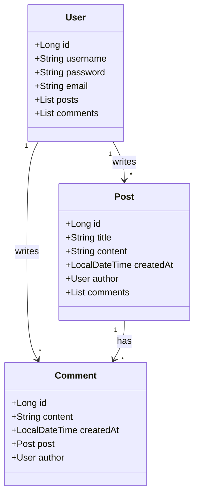

# Database Design (Schema)

## 1. Users Table
Stores user information.
- **Table Name**: `users`
- **Columns**:
    - `id` (BIGINT, PK, Auto Increment): Unique identifier
    - `username` (VARCHAR, Unique): User's login name
    - `password` (VARCHAR): Encrypted password
    - `email` (VARCHAR): User's email address
    - `created_at` (TIMESTAMP): Account creation time

## 2. Posts Table
Stores blog posts.
- **Table Name**: `posts`
- **Columns**:
    - `id` (BIGINT, PK, Auto Increment): Unique identifier
    - `title` (VARCHAR): Blog post title
    - `content` (TEXT): Blog post content
    - `created_at` (TIMESTAMP): Creation time
    - `updated_at` (TIMESTAMP): Last update time
    - `user_id` (BIGINT, FK): Author (Foreign Key to users.id)

## 3. Comments Table
Stores comments on posts.
- **Table Name**: `comments`
- **Columns**:
    - `id` (BIGINT, PK, Auto Increment): Unique identifier
    - `content` (TEXT): Comment content
    - `created_at` (TIMESTAMP): Creation time
    - `post_id` (BIGINT, FK): Related post (Foreign Key to posts.id)
    - `user_id` (BIGINT, FK): Commenter (Foreign Key to users.id)

---

# UML Class Diagram (Simplified)

