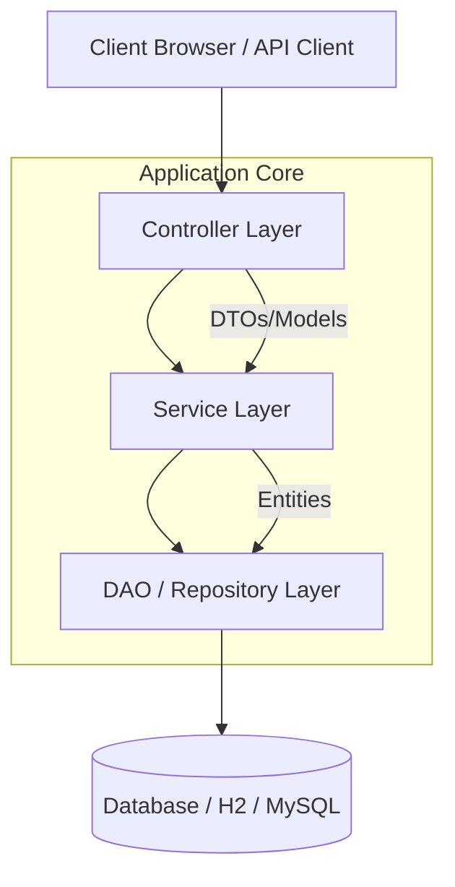
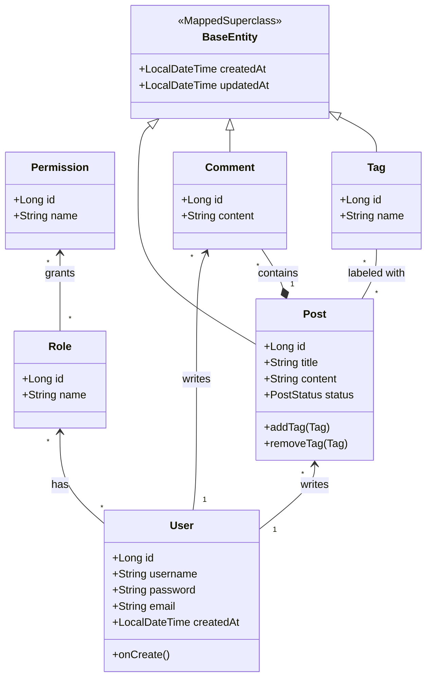

# System Design & Implementation Documentation

## 1. System Architecture Overview

This project follows the standard **Layered Architecture** pattern common in Spring Boot applications. This separation of concerns ensures maintainability, scalability, and testability.

### Layers Description
1.  **Presentation Layer (Controller)**:
    *   Handles HTTP requests and responses.
    *   Responsible for input validation and mapping requests to appropriate service methods.
    *   Interacts with the View layer (Thymeleaf) to render HTML.
    *   *Key Classes*: `BlogController`, `LoginController`, `HomeController`.

2.  **Business Logic Layer (Service)**:
    *   Contains the core business rules and logic.
    *   Orchestrates data flow between Controllers and Repositories.
    *   Handles transaction management (`@Transactional`).
    *   *Key Classes*: `UserServiceImpl`, `PostServiceImpl`, `CommentServiceImpl`.

3.  **Data Access Layer (DAO/Repository)**:
    *   Abstracts the underlying data storage mechanism.
    *   Uses Spring Data JPA for easy database interactions.
    *   *Key Interfaces*: `UserRepository`, `PostRepository`, `CommentRepository`, `TagRepository`.

4.  **Domain Model (Entity)**:
    *   Represents the data objects and database tables.
    *   Mapped using Hibernate/JPA annotations.

---

## 2. Data Structure (UML Class Diagram)

The following Class Diagram illustrates the Entity relationships within the system.

### Entity Relationships
*   **User - Role - Permission**: RBAC (Role-Based Access Control) structure. A `User` has `Roles`, a `Role` has `Permissions`.
*   **User - Post**: One-to-Many.
*   **User - Comment**: One-to-Many.
*   **Post - Comment**: One-to-Many.
*   **Post - Tag**: Many-to-Many.

---

## 3. Implemented Features

### 3.1 User Management
*   **Registration**: Users can sign up with username, email, and password. Password complexity and uniqueness checks are enforced.
*   **Authentication**: Custom `UserDetailsService` implementation using Spring Security. Support for form-based login.
*   **Authorization**: Users are assigned default `ROLE_USER`. Admin users can be pre-seeded.

### 3.2 Blog Management
*   **Create Post**: Authenticated users with `POST_CREATE` permission can create new posts.
*   **Rich Content**: Posts support a title and text content.
*   **Tagging System**:
    *   Users can add tags (comma-separated) when creating a post.
    *   Tags are automatically de-duplicated and reused if they already exist in the database.
    *   **Optimization**: Uses batch processing to minimize database queries (prevents N+1 problem).
*   **View Counting**:
    *   Atomic database updates for post view counts to ensure accuracy under high concurrency.
*   **Delete Post**:
    *   Post owners can delete their own posts.
    *   Admin users can delete any post.
*   **Listing**:
    *   Paginated view of all posts.
    *   Sorting by creation date (newest first).
    *   **Search**: Full-text search capability for post titles and content.

### 3.3 Comment System
*   **Add Comment**: Authenticated users can leave comments on any post.
*   **View Comments**: Comments are displayed chronologically on the post detail page.

### 3.4 Frontend
*   **Thymeleaf Templates**: Server-side rendering for responsive HTML pages.
*   **Bootstrap Styling**: Uses Bootstrap 4 for layout and styling.
*   **Dynamic Elements**:
    *   Conditional rendering based on auth state (e.g., "Login" vs "Logout" buttons).
    *   Conditional buttons (e.g., "Delete Post" only visible to owner/admin).
    *   Form validation feedback.

---

## 4. Security & Testing

### 4.1 Security Configuration
*   **BCrypt Hashing**: Passwords are securely hashed before storage.
*   **Method Level Security**: `@PreAuthorize` annotations protect service/controller methods (e.g., `hasAuthority('POST_CREATE')`).
*   **Global Exception Handling**: Centralized handling of security exceptions (`AccessDeniedException`) providing user-friendly error pages and secure logging.
*   **CSRF Protection**: Enabled by default in Spring Security.

### 4.2 Automated Testing
*   **Unit Tests**: Service layer is tested using **JUnit 5** and **Mockito**.
    *   `PostServiceTest`: Verifies post creation, tagging logic, and retrieval.
    *   `CommentServiceTest`: Verifies comment addition.
    *   `UserServiceTest`: Verifies user registration and role assignment.

---

## 5. Technology Stack & Code Quality

*   **Backend**: Spring Boot 3.2.0, Java 17
*   **Database**: H2 (In-Memory) / Spring Data JPA
*   **Security**: Spring Security 6
*   **Frontend**: Thymeleaf, Bootstrap 4
*   **Build**: Maven
*   **Testing**: JUnit 5, Mockito
*   **Code Quality**:
    *   **Constants**: Centralized `AppConstants` for Role and Permission management to avoid magic strings.
    *   **Logging**: Structured logging (SLF4J) for critical path actions and errors.
