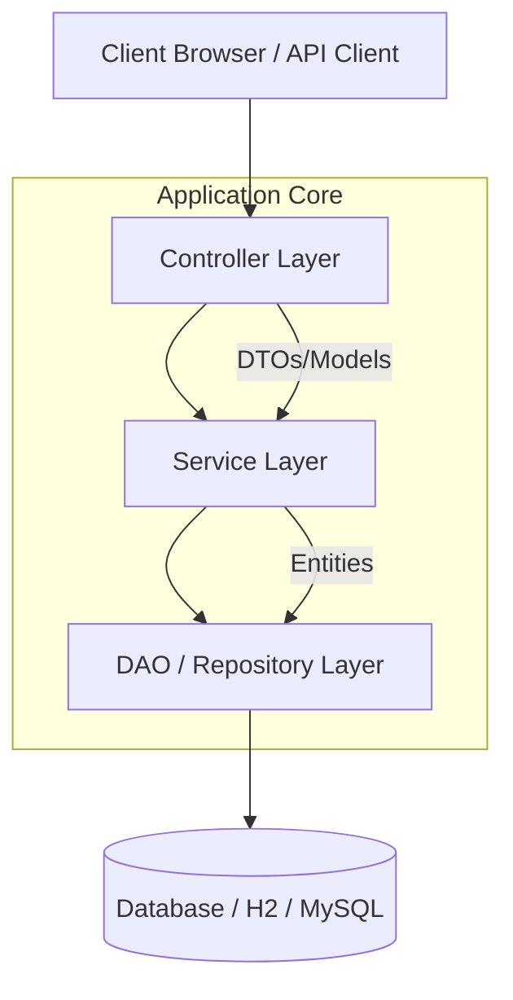
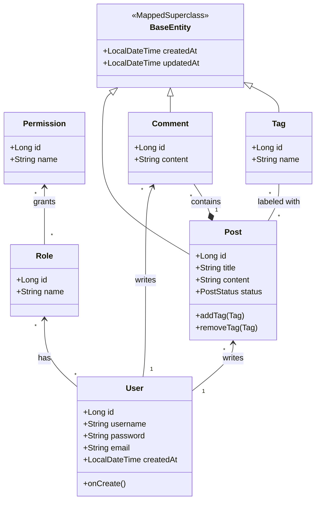

# System Design & Documentation

## 1. System Architecture Overview

This project follows the standard **Layered Architecture** pattern common in Spring Boot applications. This separation of concerns ensures maintainability, scalability, and testability.

### Layers Description
1.  **Presentation Layer (Controller)**:
    *   Handles HTTP requests and responses.
    *   Responsible for input validation and mapping requests to appropriate service methods.
    *   Interacts with the View layer (Thymeleaf) to render HTML.
    *   *Key Classes*: `BlogController`, `LoginController`, `HomeController`.

2.  **Business Logic Layer (Service)**:
    *   Contains the core business rules and logic.
    *   Orchestrates data flow between Controllers and Repositories.
    *   Handles transaction management (`@Transactional`).
    *   *Key Classes*: `UserServiceImpl`, `PostServiceImpl`, `CommentServiceImpl`.

3.  **Data Access Layer (DAO/Repository)**:
    *   Abstracts the underlying data storage mechanism.
    *   Uses Spring Data JPA for easy database interactions.
    *   *Key Interfaces*: `UserRepository`, `PostRepository`, `CommentRepository`.

4.  **Domain Model (Entity)**:
    *   Represents the data objects and database tables.
    *   Mapped using Hibernate/JPA annotations.

---

## 2. Data Structure (UML Class Diagram)

The following Class Diagram illustrates the Entity relationships within the system.

### Entity Relationships Explanation

*   **User - Role - Permission**: A typical RBAC (Role-Based Access Control) structure. A `User` can have multiple `Roles`, and a `Role` is composed of multiple granular `Permissions`.
*   **User - Post**: One-to-Many. A single user writes multiple posts.
*   **User - Comment**: One-to-Many. A single user can write multiple comments.
*   **Post - Comment**: One-to-Many. A post can have many comments associated with it.
*   **Post - Tag**: Many-to-Many. A post can have multiple tags, and a tag can be associated with multiple posts.

## 3. Technology Stack

*   **Backend Framework**: Spring Boot 3.x
*   **Build Tool**: Maven
*   **Language**: Java 17+
*   **Database**: H2 (In-Memory for Dev) / MySQL (Production ready)
*   **ORM**: Spring Data JPA / Hibernate
*   **Template Engine**: Thymeleaf
*   **Security**: Spring Security (BCrypt, Form Login)
*   **Testing**: JUnit 5, Mockito, Spring Boot Test

