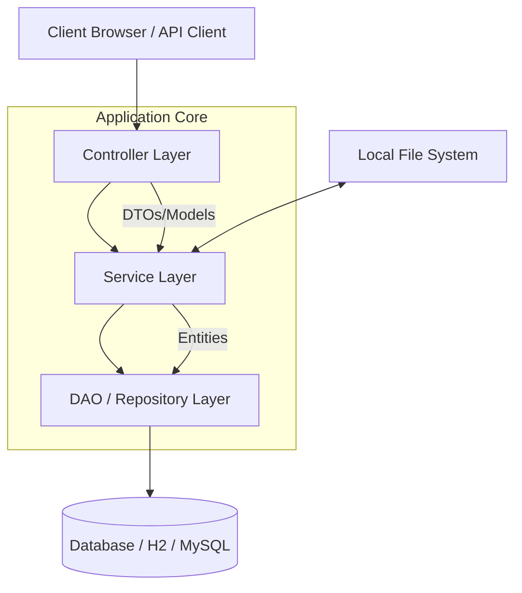
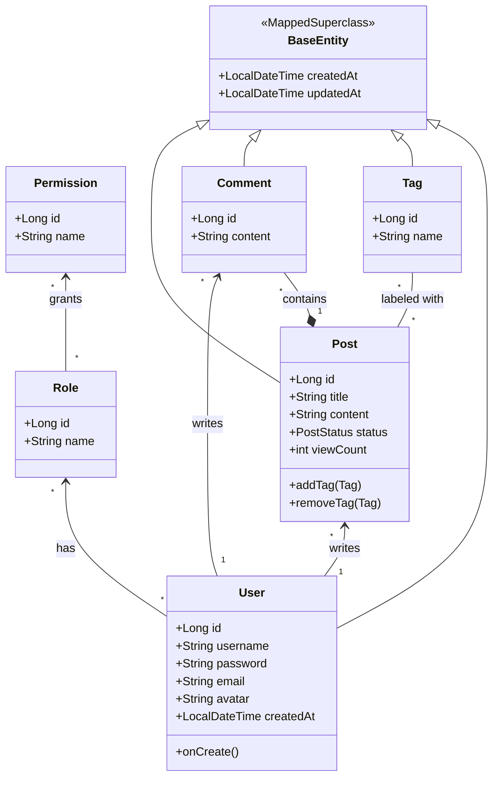

# System Design & Implementation Documentation

## 1. System Architecture Overview

This project follows the standard **Layered Architecture** pattern common in Spring Boot applications. This separation of concerns ensures maintainability, scalability, and testability.

### Layers Description
1.  **Presentation Layer (Controller)**:
    *   Handles HTTP requests and responses.
    *   Responsible for input validation and mapping requests to appropriate service methods.
    *   Interacts with the View layer (Thymeleaf) to render HTML.
    *   *Key Classes*: `BlogController`, `LoginController`, `ProfileController`.

2.  **Business Logic Layer (Service)**:
    *   Contains the core business rules and logic.
    *   Orchestrates data flow between Controllers and Repositories.
    *   Handles transaction management (`@Transactional`).
    *   *Key Classes*: `UserServiceImpl`, `PostServiceImpl`, `CommentServiceImpl`, `FileStorageServiceImpl`, `PostImportServiceImpl`, `MarkdownServiceImpl`.

3.  **Data Access Layer (DAO/Repository)**:
    *   Abstracts the underlying data storage mechanism.
    *   Uses Spring Data JPA for easy database interactions.
    *   *Key Interfaces*: `UserRepository`, `PostRepository`, `CommentRepository`, `TagRepository`.

4.  **Domain Model (Entity)**:
    *   Represents the data objects and database tables.
    *   Mapped using Hibernate/JPA annotations.

---

## 2. Data Structure (UML Class Diagram)

The following Class Diagram illustrates the Entity relationships within the system.

### Entity Relationships
*   **User - Role - Permission**: RBAC (Role-Based Access Control) structure. A `User` has `Roles`, a `Role` has `Permissions`.
*   **User - Post**: One-to-Many.
*   **User - Comment**: One-to-Many.
*   **Post - Comment**: One-to-Many.
*   **Post - Tag**: Many-to-Many.

---

## 3. Implemented Features

### 3.1 User Management
*   **Registration**: Users can sign up with username, email, and password. Password complexity and uniqueness checks are enforced.
*   **Authentication**: Custom `UserDetailsService` implementation using Spring Security. Support for form-based login and CSRF protection.
*   **Profile Management**:
    *   Update email and password securely using `UserProfileDto`.
    *   **Avatar Upload**: Users can upload profile pictures, which are stored locally and served via static resource mapping.
*   **Authorization**: Users are assigned default `ROLE_USER`. Admin users can be pre-seeded.

### 3.2 Blog Management
*   **Create Post**: Authenticated users with `POST_CREATE` permission can create new posts.
*   **Rich Content**:
    *   Posts support **Markdown** syntax (GFM).
    *   Automatic **Syntax Highlighting** for code blocks using `Highlight.js`.
*   **Tagging System**:
    *   Users can add tags (comma-separated) when creating a post.
    *   Tags are automatically de-duplicated and reused if they already exist in the database.
*   **Auto-Import**:
    *   System automatically scans `src/main/resources/posts/*.md` on startup.
    *   Parses Front Matter (YAML) for metadata and imports content into the database.
*   **View Counting**:
    *   Atomic database updates for post view counts to ensure accuracy under high concurrency.
*   **Delete Post**:
    *   Post owners can delete their own posts.
    *   Admin users can delete any post.
*   **Listing & Filtering**:
    *   Paginated view of all posts.
    *   **Specification-based Search**: Robust filtering system supporting combinations of:
        *   Keywords (Title/Content)
        *   Tags
        *   Author Name
    *   **My Posts**: Quick filter for logged-in users to see their own content.

### 3.3 Comment System
*   **Add Comment**: Authenticated users can leave comments on any post.
*   **Validation**: Backend validation ensures no empty comments are submitted.
*   **User Experience**: Error handling preserves the post view context instead of redirecting blindly.

### 3.4 Frontend
*   **Thymeleaf Templates**: Server-side rendering for responsive HTML pages.
*   **Modern UI**:
    *   Custom CSS (`style.css`) + Bootstrap 4.
    *   Card-based layouts with hover effects.
    *   FontAwesome icons for visual enhancement.
*   **Dynamic Elements**:
    *   Conditional rendering based on auth state.
    *   User avatars displayed in posts and comments.

---

## 4. Security & Testing

### 4.1 Security Configuration
*   **BCrypt Hashing**: Passwords are securely hashed before storage.
*   **Method Level Security**: `@PreAuthorize` annotations protect service/controller methods.
*   **DTO Pattern**: Strict usage of DTOs (`PostDto`, `RegisterDto`, `UserProfileDto`) to prevent Mass Assignment Vulnerabilities.
*   **CSRF Protection**: Enabled for all state-changing operations.

### 4.2 Automated Testing
*   **Unit Tests**: Service layer is tested using **JUnit 5** and **Mockito**.
    *   `PostServiceTest`: Verifies post creation, tagging logic, and retrieval.
    *   `CommentServiceTest`: Verifies comment addition.
    *   `UserServiceTest`: Verifies user registration and profile updates.
*   **Integration Tests**:
    *   `BlogControllerIntegrationTest`: Tests the full HTTP request lifecycle using `MockMvc` and H2 database.

---

## 5. Technology Stack

*   **Backend**: Spring Boot 3.2.0, Java 17
*   **Database**: H2 (In-Memory) / Spring Data JPA
*   **Security**: Spring Security 6
*   **Frontend**: Thymeleaf, Bootstrap 4, FontAwesome, Highlight.js
*   **Markdown**: commonmark-java
*   **Build**: Maven

