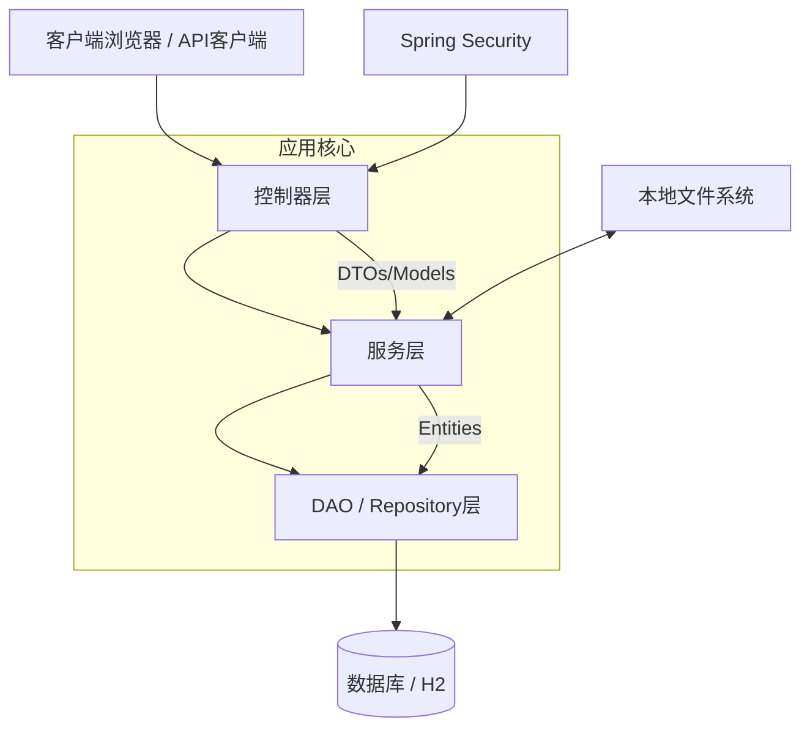
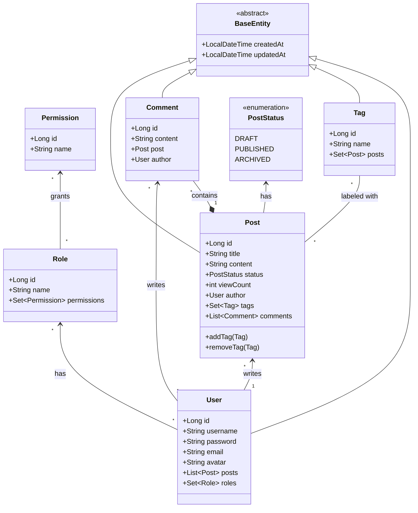

# 系统设计与实现文档

## 0. 项目概述

### 0.1 项目简介

本项目是一个基于 Spring Boot 3.2.0 开发的博客系统，采用分层架构设计，实现了用户管理、文章发布、评论互动等核心功能。系统使用 H2 数据库进行数据持久化，支持 Markdown 格式的文章编辑和渲染，并提供了基于 RBAC（角色-权限）模型的权限管理系统。

### 0.2 项目结构说明

```
school_homework/
├── data/                          # 数据库文件目录（已忽略，不提交到Git）
│   ├── blogdb.mv.db              # H2数据库主文件
│   ├── blogdb.lock.db            # 数据库锁文件
│   └── blogdb.trace.db           # 数据库跟踪日志
│
├── doc/                           # 项目文档目录
│   └── system_documentation.md   # 系统设计与实现文档（本文档）
│
├── src/                           # 源代码目录
│   ├── main/                     # 主代码目录
│   │   ├── java/                # Java源代码
│   │   │   └── com/school/homework/
│   │   │       ├── config/      # 配置类目录
│   │   │       │   ├── DataInitializer.java      # 数据初始化配置（启动时创建默认数据）
│   │   │       │   ├── JpaConfig.java            # JPA配置（审计功能）
│   │   │       │   ├── OpenApiConfig.java        # OpenAPI/Swagger配置
│   │   │       │   ├── SecurityConfig.java       # Spring Security安全配置
│   │   │       │   └── WebConfig.java            # Web MVC配置
│   │   │       │
│   │   │       ├── constant/    # 常量定义目录
│   │   │       │   └── AppConstants.java         # 应用常量（角色名、权限名等）
│   │   │       │
│   │   │       ├── controller/  # 控制器目录（表示层）
│   │   │       │   ├── BlogController.java      # 博客文章和评论控制器
│   │   │       │   ├── HomeController.java      # 首页控制器（重定向）
│   │   │       │   ├── LoginController.java     # 登录和注册控制器
│   │   │       │   └── ProfileController.java   # 用户资料管理控制器
│   │   │       │
│   │   │       ├── dao/          # 数据访问层（Repository接口）
│   │   │       │   ├── CommentRepository.java   # 评论数据访问接口
│   │   │       │   ├── PermissionRepository.java # 权限数据访问接口
│   │   │       │   ├── PostRepository.java      # 文章数据访问接口
│   │   │       │   ├── RoleRepository.java      # 角色数据访问接口
│   │   │       │   ├── TagRepository.java       # 标签数据访问接口
│   │   │       │   ├── UserRepository.java      # 用户数据访问接口
│   │   │       │   └── specification/           # 动态查询规范目录
│   │   │       │       └── PostSpecification.java # 文章动态查询规范
│   │   │       │
│   │   │       ├── dto/          # 数据传输对象目录
│   │   │       │   ├── CommentDto.java          # 评论DTO
│   │   │       │   ├── PostDto.java              # 文章DTO
│   │   │       │   ├── PostSearchCriteria.java   # 文章搜索条件DTO
│   │   │       │   ├── RegisterDto.java         # 注册DTO
│   │   │       │   ├── TagDto.java               # 标签DTO
│   │   │       │   ├── UserDto.java              # 用户DTO
│   │   │       │   ├── UserInfoDto.java          # 用户信息DTO
│   │   │       │   ├── UserPasswordDto.java     # 用户密码DTO
│   │   │       │   └── UserProfileDto.java      # 用户资料DTO
│   │   │       │
│   │   │       ├── entity/       # 实体类目录（领域模型）
│   │   │       │   ├── BaseEntity.java          # 基础实体类（审计字段）
│   │   │       │   ├── Comment.java             # 评论实体
│   │   │       │   ├── Permission.java          # 权限实体
│   │   │       │   ├── Post.java                 # 文章实体
│   │   │       │   ├── Role.java                 # 角色实体
│   │   │       │   ├── Tag.java                  # 标签实体
│   │   │       │   └── User.java                 # 用户实体
│   │   │       │
│   │   │       ├── enums/        # 枚举类目录
│   │   │       │   └── PostStatus.java          # 文章状态枚举（DRAFT/PUBLISHED/ARCHIVED）
│   │   │       │
│   │   │       ├── exception/    # 异常类目录
│   │   │       │   ├── DuplicateResourceException.java    # 资源重复异常
│   │   │       │   ├── GlobalExceptionHandler.java       # 全局异常处理器
│   │   │       │   └── ResourceNotFoundException.java     # 资源未找到异常
│   │   │       │
│   │   │       ├── security/    # 安全相关目录
│   │   │       │   └── CustomUserDetailsService.java      # 自定义用户详情服务
│   │   │       │
│   │   │       ├── service/     # 服务层接口和实现
│   │   │       │   ├── CommentService.java      # 评论服务接口
│   │   │       │   ├── FileStorageService.java  # 文件存储服务接口
│   │   │       │   ├── MarkdownService.java     # Markdown渲染服务接口
│   │   │       │   ├── PostImportService.java   # 文章导入服务接口
│   │   │       │   ├── PostService.java         # 文章服务接口
│   │   │       │   ├── UserService.java         # 用户服务接口
│   │   │       │   └── impl/                    # 服务实现类目录
│   │   │       │       ├── CommentServiceImpl.java      # 评论服务实现
│   │   │       │       ├── FileStorageServiceImpl.java  # 文件存储服务实现
│   │   │       │       ├── MarkdownServiceImpl.java     # Markdown渲染服务实现
│   │   │       │       ├── PostImportServiceImpl.java  # 文章导入服务实现
│   │   │       │       ├── PostServiceImpl.java         # 文章服务实现
│   │   │       │       └── UserServiceImpl.java         # 用户服务实现
│   │   │       │
│   │   │       └── SchoolHomeworkApplication.java # Spring Boot主启动类
│   │   │
│   │   └── resources/           # 资源文件目录
│   │       ├── application.properties    # 应用配置文件
│   │       ├── posts/                    # Markdown文章资源目录（自动导入）
│   │       │   ├── auto-import-guide.md  # 自动导入指南示例
│   │       │   └── markdown-demo.md      # Markdown演示示例
│   │       ├── static/                   # 静态资源目录
│   │       │   └── css/
│   │       │       └── style.css         # 自定义样式表
│   │       └── templates/                # Thymeleaf模板目录
│   │           ├── blog/                 # 博客相关模板
│   │           │   ├── create_post.html  # 创建文章页面
│   │           │   ├── edit_post.html    # 编辑文章页面
│   │           │   ├── post_detail.html  # 文章详情页面
│   │           │   └── posts.html        # 文章列表页面
│   │           ├── error/                # 错误页面模板
│   │           │   ├── 403.html         # 403禁止访问页面
│   │           │   ├── 404.html         # 404未找到页面
│   │           │   ├── 409.html         # 409冲突页面
│   │           │   └── error.html       # 通用错误页面
│   │           ├── fragments/            # 页面片段模板
│   │           │   ├── head.html        # 页面头部片段
│   │           │   └── header.html      # 导航栏片段
│   │           ├── login.html            # 登录页面
│   │           ├── profile.html          # 用户资料页面
│   │           └── register.html         # 注册页面
│   │
│   └── test/                      # 测试代码目录
│       └── java/                  # Java测试代码
│           └── com/school/homework/
│               ├── controller/   # 控制器测试
│               │   ├── BlogControllerIntegrationTest.java
│               │   └── LoginControllerTest.java
│               └── service/       # 服务层测试
│                   ├── CommentServiceTest.java
│                   ├── PostServiceTest.java
│                   └── UserServiceTest.java
│
├── target/                         # Maven编译输出目录（已忽略）
│
├── uploads/                        # 用户上传文件目录（已忽略）
│   └── avatars/                    # 用户头像存储目录
│
├── .gitignore                      # Git忽略文件配置
├── pom.xml                         # Maven项目配置文件
└── README.md                       # 项目说明文档
```

### 0.3 目录结构说明

#### 核心代码目录

- **config/**: 存放 Spring Boot 配置类，包括安全配置、JPA配置、Web配置等
- **controller/**: 控制器层，处理 HTTP 请求，负责请求路由和参数验证
- **service/**: 服务层，包含接口定义和实现类，封装业务逻辑
- **dao/**: 数据访问层，Spring Data JPA Repository 接口，定义数据库操作方法
- **entity/**: 实体类，JPA 实体，映射数据库表结构
- **dto/**: 数据传输对象，用于控制器和服务层之间的数据传输
- **exception/**: 自定义异常类和全局异常处理器
- **security/**: Spring Security 相关配置和自定义用户详情服务
- **constant/**: 应用常量定义（角色名、权限名等）
- **enums/**: 枚举类定义

#### 资源文件目录

- **resources/application.properties**: 应用配置文件，包含数据库连接、默认用户等配置
- **resources/posts/**: Markdown 文件目录，应用启动时自动导入这些文件作为初始文章
- **resources/static/**: 静态资源目录，存放 CSS、JS、图片等静态文件
- **resources/templates/**: Thymeleaf 模板目录，存放 HTML 模板文件

#### 其他目录

- **data/**: H2 数据库文件存储目录（运行时生成，不提交到 Git）
- **uploads/**: 用户上传文件存储目录（不提交到 Git）
- **target/**: Maven 编译输出目录（不提交到 Git）
- **doc/**: 项目文档目录

### 0.4 技术栈

- **后端框架**: Spring Boot 3.2.0
- **编程语言**: Java 17
- **构建工具**: Maven
- **数据库**: H2 Database（文件模式）
- **ORM**: Spring Data JPA + Hibernate
- **安全框架**: Spring Security 6（RBAC模型）
- **模板引擎**: Thymeleaf
- **Markdown引擎**: commonmark-java 0.21.0
- **前端框架**: Bootstrap 4

---

## 1. 系统架构概览

本项目采用标准的**分层架构**模式，这是 Spring Boot 应用程序中常见的架构模式。这种关注点分离确保了可维护性、可扩展性和可测试性。



### 层次说明

1. **表示层 (Controller)**:

   - **职责**: 处理 HTTP 请求，验证输入（`@Valid`），并将请求映射到服务方法。
   - **技术**: Spring MVC, Thymeleaf 用于服务端渲染。
   - **关键类**: `BlogController`（文章/评论），`LoginController`（认证），`ProfileController`（用户资料），`HomeController`（首页重定向）。

2. **业务逻辑层 (Service)**:

   - **职责**: 封装业务规则、事务管理（`@Transactional`）和数据编排。
   - **技术**: Spring Service 组件。
   - **关键类**:
     - `UserServiceImpl` - 用户管理服务
     - `PostServiceImpl` - 文章管理服务
     - `CommentServiceImpl` - 评论服务
     - `FileStorageServiceImpl` - 文件存储服务
     - `PostImportServiceImpl` - 文章导入服务
     - `MarkdownServiceImpl` - Markdown 渲染服务

3. **数据访问层 (DAO/Repository)**:

   - **职责**: 抽象数据库交互。
   - **技术**: Spring Data JPA。
   - **关键接口**:
     - `UserRepository` - 用户数据访问
     - `PostRepository` - 文章数据访问（支持 Specification 查询）
     - `CommentRepository` - 评论数据访问
     - `TagRepository` - 标签数据访问
     - `RoleRepository` - 角色数据访问
     - `PermissionRepository` - 权限数据访问

4. **领域模型 (Entity)**:

   - **职责**: 映射到数据库表的持久化数据对象。
   - **技术**: JPA / Hibernate 注解。

5. **安全层 (Security)**:
   - **职责**: 处理认证和授权。
   - **技术**: Spring Security 6，基于 RBAC（角色-权限）模型。
   - **关键类**: `SecurityConfig`, `CustomUserDetailsService`。

---

## 2. 数据结构 (UML 类图)

以下类图详细说明了系统中的实体关系和字段。



### 详细数据结构说明

#### 2.1 BaseEntity（基础实体类）

- **类型**: 抽象基类（`@MappedSuperclass`）
- **字段**:
  - `createdAt` (LocalDateTime): 创建时间，自动设置，不可更新
  - `updatedAt` (LocalDateTime): 更新时间，自动更新
- **功能**: 提供审计字段，所有实体类继承此类

#### 2.2 User（用户实体）

- **表名**: `users`
- **字段**:
  - `id` (Long): 主键，自增
  - `username` (String): 用户名，唯一，3-20 字符
  - `password` (String): 密码，BCrypt 加密，最少 6 字符
  - `email` (String): 邮箱，唯一，需符合邮箱格式
  - `avatar` (String): 头像文件名（存储在文件系统中）
- **关系**:
  - `posts` (OneToMany): 用户创建的文章列表
  - `roles` (ManyToMany): 用户拥有的角色集合（通过 `users_roles` 中间表）

#### 2.3 Post（文章实体）

- **表名**: `posts`
- **字段**:
  - `id` (Long): 主键，自增
  - `title` (String): 标题，必填，最大 100 字符
  - `content` (TEXT): 内容，Markdown 格式，必填
  - `status` (PostStatus): 状态枚举（DRAFT/PUBLISHED/ARCHIVED），默认 DRAFT
  - `viewCount` (int): 浏览次数，默认 0，原子递增
  - `author` (User): 作者，多对一关系
  - `tags` (Set<Tag>): 标签集合，多对多关系（通过 `post_tags` 中间表）
  - `comments` (List<Comment>): 评论列表，一对多关系
- **方法**:
  - `addTag(Tag)`: 添加标签，同时维护双向关系
  - `removeTag(Tag)`: 移除标签，同时维护双向关系

#### 2.4 Comment（评论实体）

- **表名**: `comments`
- **字段**:
  - `id` (Long): 主键，自增
  - `content` (TEXT): 评论内容，必填
  - `post` (Post): 所属文章，多对一关系
  - `author` (User): 评论作者，多对一关系

#### 2.5 Tag（标签实体）

- **表名**: `tags`
- **字段**:
  - `id` (Long): 主键，自增
  - `name` (String): 标签名称，唯一，必填
  - `posts` (Set<Post>): 使用该标签的文章集合，多对多关系

#### 2.6 Role（角色实体）

- **表名**: `roles`
- **字段**:
  - `id` (Long): 主键，自增
  - `name` (String): 角色名称，唯一（如 "ROLE_ADMIN", "ROLE_USER"）
  - `permissions` (Set<Permission>): 权限集合，多对多关系（通过 `roles_permissions` 中间表）

#### 2.7 Permission（权限实体）

- **表名**: `permissions`
- **字段**:
  - `id` (Long): 主键，自增
  - `name` (String): 权限名称，唯一（如 "POST_CREATE", "POST_DELETE"）

#### 2.8 PostStatus（文章状态枚举）

- **值**:
  - `DRAFT`: 草稿
  - `PUBLISHED`: 已发布
  - `ARCHIVED`: 已归档

### DTO（数据传输对象）结构

#### PostDto（文章 DTO）

- **用途**: 文章创建/编辑表单数据传输
- **字段**:
  - `id`, `title`, `content`, `status`
  - `authorName`, `createdAt`, `updatedAt`
  - `comments`, `tags`
  - `tagString`: 标签字符串（逗号分隔，用于表单绑定）

#### CommentDto（评论 DTO）

- **用途**: 评论创建表单数据传输
- **字段**: `id`, `content`, `authorName`, `createdAt`

#### RegisterDto（注册 DTO）

- **用途**: 用户注册表单数据传输
- **字段**: `username`, `password`, `email`
- **验证**: 用户名 3-20 字符，密码最少 6 字符，邮箱格式验证

#### UserProfileDto（用户资料 DTO）

- **用途**: 用户资料编辑表单数据传输
- **字段**: `username`（只读）, `email`, `newPassword`, `confirmNewPassword`, `avatar`（MultipartFile）, `currentAvatar`

#### PostSearchCriteria（文章搜索条件 DTO）

- **用途**: 文章搜索条件封装
- **字段**: `query`（标题/内容搜索）, `tag`（标签过滤）, `authorUsername`（作者过滤）

---

## 3. 已实现功能

### 3.1 用户管理

#### 3.1.1 用户注册

- **路由**: `GET/POST /register`
- **功能**:
  - 验证用户名唯一性（3-20 字符）
  - 验证邮箱唯一性和格式
  - 验证密码强度（最少 6 字符）
  - 自动分配默认角色 `ROLE_USER`
  - 密码使用 BCrypt 加密存储
- **异常处理**: 用户名或邮箱已存在时抛出 `DuplicateResourceException`

#### 3.1.2 用户认证

- **路由**: `GET /login`, `POST /login`（由 Spring Security 处理）
- **功能**:
  - 基于表单的登录认证
  - 登录成功后重定向到首页
  - 支持登出功能（`POST /logout`）
- **安全**: 使用 `CustomUserDetailsService` 加载用户信息和权限

#### 3.1.3 用户资料管理

- **路由**: `GET/POST /profile`
- **功能**:
  - 查看个人资料（用户名、邮箱、头像）
  - 更新邮箱（需验证唯一性）
  - 修改密码（需确认密码匹配）
  - 上传/更新头像
    - 支持图片文件上传
    - 文件存储在 `uploads/avatars/` 目录
    - 使用 UUID 生成唯一文件名
    - 更新头像时自动删除旧头像文件

### 3.2 博客内容管理

#### 3.2.1 文章 CRUD 操作

**创建文章**

- **路由**: `GET /blog/posts/new`, `POST /blog/posts`
- **权限**: 需要 `POST_CREATE` 权限
- **功能**:
  - 创建新文章（标题、内容、状态、标签）
  - 内容支持 Markdown 格式
  - 标签处理：支持逗号分隔的标签字符串，自动去重和创建新标签
  - 自动关联当前登录用户为作者

**查看文章列表**

- **路由**: `GET /blog`
- **功能**:
  - 分页显示文章列表（默认每页 5 条）
  - 按创建时间倒序排列
  - 支持高级搜索和过滤（见 3.2.3）

**查看文章详情**

- **路由**: `GET /blog/posts/{id}`
- **功能**:
  - 显示文章完整内容
  - Markdown 内容自动渲染为 HTML
  - 自动递增浏览次数（原子操作）
  - 显示文章标签和评论列表
  - 提供评论表单

**编辑文章**

- **路由**: `GET /blog/posts/{id}/edit`, `POST /blog/posts/{id}/edit`
- **权限**: 需要 `POST_UPDATE` 权限
- **功能**:
  - 仅文章作者可以编辑自己的文章
  - 更新文章标题、内容、状态、标签
  - 标签同步：清除旧标签，重新添加新标签

**删除文章**

- **路由**: `POST /blog/posts/{id}/delete`
- **权限**: 需要 `POST_DELETE` 权限
- **功能**:
  - 文章作者可以删除自己的文章
  - 管理员可以删除任何文章
  - 级联删除关联的评论

#### 3.2.2 Markdown 渲染

- **技术**: `commonmark-java` (0.21.0)
- **扩展**:
  - GFM Tables Extension: 支持 GitHub 风格的表格
  - Autolink Extension: 自动识别和链接 URL
- **前端**: 使用 `highlight.js` 进行代码高亮

#### 3.2.3 搜索和过滤

- **功能**:
  - **标题/内容搜索**: 支持在标题和内容中搜索关键词（不区分大小写）
  - **标签过滤**: 按标签名称过滤文章
  - **作者过滤**: 按作者用户名过滤文章
  - **组合查询**: 支持多个条件组合查询
- **实现**: 使用 JPA Specification 动态构建查询条件
- **分页**: 所有搜索结果支持分页

#### 3.2.4 标签系统

- **功能**:
  - 文章可以关联多个标签
  - 标签名称唯一
  - 批量查询优化：避免 N+1 查询问题
  - 自动去重：相同名称的标签只创建一个实体

#### 3.2.5 文章自动导入

- **触发时机**: 应用启动时自动执行
- **功能**:
  - 扫描 `classpath:posts/*.md` 目录下的所有 Markdown 文件
  - 解析 YAML Front Matter（标题、作者、标签）
  - 自动创建文章（状态为 PUBLISHED）
  - 去重：如果文章标题已存在，跳过导入
  - 日志记录：记录导入成功和失败的文件

**Front Matter 格式示例**:

```yaml
---
title: 文章标题
author: 作者用户名
tags: 标签1, 标签2, 标签3
---
文章正文内容...
```

### 3.3 评论系统

#### 3.3.1 添加评论

- **路由**: `POST /blog/posts/{postId}/comments`
- **权限**: 需要 `COMMENT_CREATE` 权限
- **功能**:
  - 认证用户可以评论文章
  - 评论内容必填
  - 自动关联当前用户和文章
  - 评论显示在文章详情页

#### 3.3.2 评论显示

- **功能**:
  - 在文章详情页显示所有评论
  - 显示评论作者、内容和创建时间
  - 按创建时间排序

### 3.4 权限和角色管理

#### 3.4.1 角色定义

- **ROLE_ADMIN**: 管理员角色
  - 权限: `POST_CREATE`, `POST_READ`, `POST_UPDATE`, `POST_DELETE`, `COMMENT_CREATE`, `COMMENT_DELETE`
- **ROLE_USER**: 普通用户角色
  - 权限: `POST_CREATE`, `POST_READ`, `COMMENT_CREATE`

#### 3.4.2 权限控制

- **方法级安全**: 使用 `@PreAuthorize` 注解控制方法访问
- **数据级安全**: 在服务层检查资源所有权（如文章编辑权限）
- **默认用户**: 系统启动时自动创建管理员和普通用户账户

### 3.5 文件存储

#### 3.5.1 头像存储

- **存储位置**: `uploads/avatars/`（可配置）
- **文件命名**: UUID + 原始文件扩展名
- **安全**: 防止路径遍历攻击（检查文件名中的 ".."）
- **清理**: 更新头像时自动删除旧文件

### 3.6 异常处理

#### 3.6.1 全局异常处理器

- **类**: `GlobalExceptionHandler`（`@ControllerAdvice`）
- **处理的异常**:
  - `ResourceNotFoundException` → 404 错误页
  - `DuplicateResourceException` → 409 错误页
  - `AccessDeniedException` → 403 错误页
  - `NoResourceFoundException` → 404 错误页
  - `Exception` → 500 错误页
- **功能**: 统一错误页面展示，记录错误日志

---

## 4. 函数调用链（关键流程）

### 4.1 文章创建流程

**调用链**:

```
BlogController.createPost()
  ↓
  @Valid PostDto 验证
  ↓
PostService.createPost(PostDto, username)
  ↓
UserRepository.findByUsername(username)
  ↓
Post 实体创建和属性设置
  ↓
PostService.processTags(post, tagString)
  ↓
  ├─ 分割标签字符串
  ├─ TagRepository.findByNameIn(tagNames) [批量查询]
  ├─ 创建新标签实体
  └─ TagRepository.saveAll(newTags)
  ↓
PostRepository.save(post)
```

**关键函数**:

- `PostServiceImpl.createPost()`: 创建文章主逻辑
- `PostServiceImpl.processTags()`: 标签处理逻辑（避免 N+1 查询）

### 4.2 文章搜索流程

**调用链**:

```
BlogController.listPosts(PostSearchCriteria, Pageable)
  ↓
PostService.searchPosts(criteria, pageable)
  ↓
PostSpecification.withCriteria(criteria)
  ↓
  ├─ 构建 JPA Predicate
  ├─ 如果 query 不为空 → 添加 title/content LIKE 条件
  ├─ 如果 tag 不为空 → JOIN tags 表并添加过滤条件
  └─ 如果 authorUsername 不为空 → JOIN author 表并添加过滤条件
  ↓
PostRepository.findAll(Specification, Pageable)
  ↓
  @EntityGraph(attributePaths = {"author", "tags"}) [避免 N+1]
  ↓
返回 Page<Post>
```

**关键函数**:

- `PostSpecification.withCriteria()`: 动态查询条件构建
- `PostRepository.findAll(Specification, Pageable)`: 执行动态查询

### 4.3 文章查看流程

**调用链**:

```
BlogController.viewPost(id)
  ↓
PostService.incrementViewCount(id)
  ↓
PostRepository.incrementViewCount(id) [@Modifying 原子更新]
  ↓
PostService.getPostById(id)
  ↓
MarkdownService.renderToHtml(post.getContent())
  ↓
  ├─ Parser.parse(markdown)
  └─ HtmlRenderer.render(document)
  ↓
返回渲染后的 HTML 和文章实体
```

**关键函数**:

- `PostRepository.incrementViewCount()`: 原子递增浏览次数
- `MarkdownServiceImpl.renderToHtml()`: Markdown 转 HTML

### 4.4 文章更新流程

**调用链**:

```
BlogController.updatePost(id, PostDto, principal)
  ↓
PostService.updatePost(id, postDto, username)
  ↓
PostService.getPostById(id)
  ↓
所有权检查: existingPost.getAuthor().getUsername().equals(username)
  ↓
  ├─ 如果失败 → 抛出 AccessDeniedException
  └─ 如果成功 → 继续更新
  ↓
更新文章属性
  ↓
existingPost.getTags().clear()
  ↓
PostService.processTags(existingPost, tagString)
  ↓
PostRepository.save(existingPost)
```

**关键函数**:

- `PostServiceImpl.updatePost()`: 更新文章主逻辑（包含权限检查）

### 4.5 文章删除流程

**调用链**:

```
BlogController.deletePost(id, principal)
  ↓
PostService.deletePost(id, username)
  ↓
PostService.getPostById(id)
  ↓
所有权/管理员检查
  ↓
  ├─ 如果是作者 → 允许删除
  ├─ 如果是管理员 → 允许删除
  └─ 否则 → 抛出 AccessDeniedException
  ↓
PostRepository.deleteById(id)
```

**关键函数**:

- `PostServiceImpl.deletePost()`: 删除文章主逻辑（包含权限检查）

### 4.6 用户注册流程

**调用链**:

```
LoginController.register(RegisterDto)
  ↓
@Valid RegisterDto 验证
  ↓
UserService.registerUser(RegisterDto)
  ↓
  ├─ UserRepository.findByUsername(username) [检查唯一性]
  ├─ UserRepository.findByEmail(email) [检查唯一性]
  └─ 如果存在 → 抛出 DuplicateResourceException
  ↓
创建 User 实体
  ↓
PasswordEncoder.encode(password) [BCrypt 加密]
  ↓
RoleRepository.findByName("ROLE_USER")
  ↓
User.setRoles(Collections.singleton(userRole))
  ↓
UserRepository.save(user)
```

**关键函数**:

- `UserServiceImpl.registerUser()`: 用户注册主逻辑

### 4.7 用户资料更新流程

**调用链**:

```
ProfileController.updateProfile(UserProfileDto, principal)
  ↓
@Valid UserProfileDto 验证
  ↓
UserService.updateUserProfile(username, userProfileDto)
  ↓
UserRepository.findByUsername(username)
  ↓
  ├─ 如果 email 改变 → 检查邮箱唯一性
  ├─ 如果 newPassword 不为空 → 验证密码匹配并加密
  └─ 如果 avatar 不为空 → 处理文件上传
  ↓
文件上传分支:
  ├─ FileStorageService.deleteFile(oldAvatar) [删除旧头像]
  └─ FileStorageService.saveFile(newAvatar)
      ├─ 生成 UUID 文件名
      └─ 保存到 uploads/avatars/
  ↓
UserRepository.save(user)
```

**关键函数**:

- `UserServiceImpl.updateUserProfile()`: 用户资料更新主逻辑
- `FileStorageServiceImpl.saveFile()`: 文件保存逻辑
- `FileStorageServiceImpl.deleteFile()`: 文件删除逻辑

### 4.8 评论添加流程

**调用链**:

```
BlogController.addComment(postId, CommentDto, principal)
  ↓
@Valid CommentDto 验证
  ↓
CommentService.addComment(commentDto, postId, username)
  ↓
  ├─ PostRepository.findById(postId)
  └─ UserRepository.findByUsername(username)
  ↓
创建 Comment 实体
  ↓
Comment.setPost(post)
Comment.setAuthor(user)
Comment.setContent(content)
  ↓
CommentRepository.save(comment)
```

**关键函数**:

- `CommentServiceImpl.addComment()`: 添加评论主逻辑

### 4.9 文章自动导入流程

**调用链**:

```
应用启动
  ↓
DataInitializer.run() [CommandLineRunner]
  ↓
PostImportService.importPostsFromResources()
  ↓
PathMatchingResourcePatternResolver.getResources("classpath:posts/*.md")
  ↓
循环处理每个文件:
  ├─ PostImportServiceImpl.importSinglePost(resource)
  │   ├─ readResource(resource) [读取文件内容]
  │   ├─ parseFrontMatter(content) [解析 YAML Front Matter]
  │   ├─ PostService.getAllPosts() [检查标题是否已存在]
  │   ├─ 如果存在 → 跳过
  │   └─ 如果不存在 → 创建 PostDto 并调用 PostService.createPost()
  └─ 记录日志
```

**关键函数**:

- `PostImportServiceImpl.importPostsFromResources()`: 导入主逻辑
- `PostImportServiceImpl.parseFrontMatter()`: 解析 Front Matter

### 4.10 用户认证流程

**调用链**:

```
用户提交登录表单
  ↓
Spring Security 拦截 POST /login
  ↓
DaoAuthenticationProvider.authenticate()
  ↓
CustomUserDetailsService.loadUserByUsername(username)
  ↓
  ├─ UserRepository.findByUsername(username)
  ├─ 加载用户角色和权限
  └─ 构建 UserDetails 对象（包含权限）
  ↓
PasswordEncoder.matches(rawPassword, encodedPassword)
  ↓
  ├─ 如果匹配 → 创建 Authentication 对象
  └─ 如果失败 → 抛出 BadCredentialsException
  ↓
SecurityContext 保存 Authentication
  ↓
重定向到默认成功页面
```

**关键函数**:

- `CustomUserDetailsService.loadUserByUsername()`: 加载用户详情和权限

---

## 5. 关键类和函数详解

### 5.1 控制器层（Controller Layer）

#### BlogController

**职责**: 处理博客文章和评论相关的 HTTP 请求

**关键方法**:

- `listPosts(PostSearchCriteria, int page, int size, Model)`

  - **功能**: 显示文章列表，支持搜索和分页
  - **参数**: 搜索条件、页码、每页大小
  - **返回**: `blog/posts` 视图
  - **关键逻辑**: 构建 Pageable 对象，调用服务层搜索方法

- `viewPost(Long id, Model)`

  - **功能**: 显示文章详情
  - **关键逻辑**:
    - 原子递增浏览次数
    - 调用 Markdown 服务渲染内容
    - 准备评论表单

- `createPost(PostDto, BindingResult, Principal)`

  - **功能**: 创建新文章
  - **权限**: `@PreAuthorize("hasAuthority('POST_CREATE')")`
  - **关键逻辑**: 表单验证，调用服务层创建方法

- `editPostForm(Long id, Model, Principal)`

  - **功能**: 显示文章编辑表单
  - **权限**: `@PreAuthorize("hasAuthority('POST_UPDATE')")`
  - **关键逻辑**: 检查文章所有权，只有作者可以编辑

- `updatePost(Long id, PostDto, BindingResult, Principal, Model)`

  - **功能**: 更新文章
  - **权限**: `@PreAuthorize("hasAuthority('POST_UPDATE')")`
  - **关键逻辑**: 服务层会再次检查所有权

- `deletePost(Long id, Principal)`

  - **功能**: 删除文章
  - **权限**: `@PreAuthorize("hasAuthority('POST_DELETE')")`
  - **关键逻辑**: 服务层检查所有权或管理员权限

- `addComment(Long postId, CommentDto, BindingResult, Principal, Model)`
  - **功能**: 添加评论
  - **权限**: `@PreAuthorize("hasAuthority('COMMENT_CREATE')")`
  - **关键逻辑**: 表单验证，调用服务层添加评论

#### LoginController

**职责**: 处理用户登录和注册

**关键方法**:

- `register(RegisterDto, BindingResult)`
  - **功能**: 用户注册
  - **关键逻辑**: 表单验证，调用服务层注册方法，异常处理

#### ProfileController

**职责**: 处理用户资料管理

**关键方法**:

- `viewProfile(Model, Principal)`

  - **功能**: 显示用户资料
  - **关键逻辑**: 加载当前用户信息，转换为 DTO

- `updateProfile(UserProfileDto, BindingResult, Principal, Model)`
  - **功能**: 更新用户资料
  - **关键逻辑**: 表单验证，处理文件上传，异常处理

#### HomeController

**职责**: 处理首页重定向

**关键方法**:

- `index()`: 重定向到 `/blog`

### 5.2 服务层（Service Layer）

#### PostServiceImpl

**职责**: 文章业务逻辑处理

**关键方法**:

- `createPost(PostDto, String username)`

  - **功能**: 创建文章
  - **事务**: `@Transactional`
  - **关键逻辑**:
    1. 根据用户名查找用户
    2. 创建 Post 实体并设置属性
    3. 调用 `processTags()` 处理标签
    4. 保存到数据库

- `processTags(Post, String tags)`

  - **功能**: 处理文章标签（核心方法）
  - **优化**: 批量查询避免 N+1 问题
  - **关键逻辑**:
    1. 分割标签字符串（逗号分隔）
    2. 去重和过滤空字符串
    3. 批量查询已存在的标签（`TagRepository.findByNameIn()`）
    4. 创建不存在的标签
    5. 批量保存新标签
    6. 关联标签到文章（调用 `Post.addTag()`）

- `updatePost(Long id, PostDto, String username)`

  - **功能**: 更新文章
  - **事务**: `@Transactional`
  - **权限检查**: 检查文章所有权
  - **关键逻辑**:
    1. 查找文章
    2. 检查所有权（不是作者则抛出异常）
    3. 更新文章属性
    4. 清除旧标签
    5. 重新处理标签

- `deletePost(Long id, String username)`

  - **功能**: 删除文章
  - **事务**: `@Transactional`
  - **权限检查**: 检查所有权或管理员权限
  - **关键逻辑**:
    1. 查找文章
    2. 检查是否为作者
    3. 如果不是作者，检查是否为管理员
    4. 删除文章（级联删除评论）

- `searchPosts(PostSearchCriteria, Pageable)`

  - **功能**: 搜索文章
  - **关键逻辑**: 使用 Specification 构建动态查询

- `incrementViewCount(Long id)`
  - **功能**: 递增浏览次数
  - **关键逻辑**: 调用 Repository 的原子更新方法

#### UserServiceImpl

**职责**: 用户业务逻辑处理

**关键方法**:

- `registerUser(RegisterDto)`

  - **功能**: 用户注册
  - **事务**: `@Transactional`
  - **关键逻辑**:
    1. 检查用户名唯一性
    2. 检查邮箱唯一性
    3. 创建用户实体
    4. 加密密码
    5. 分配默认角色 ROLE_USER
    6. 保存用户

- `updateUserProfile(String username, UserProfileDto)`
  - **功能**: 更新用户资料
  - **事务**: `@Transactional`
  - **关键逻辑**:
    1. 查找用户
    2. 更新邮箱（检查唯一性）
    3. 更新密码（如果提供）
    4. 处理头像上传（删除旧文件，保存新文件）

#### CommentServiceImpl

**职责**: 评论业务逻辑处理

**关键方法**:

- `addComment(CommentDto, Long postId, String username)`
  - **功能**: 添加评论
  - **事务**: `@Transactional`
  - **关键逻辑**:
    1. 查找文章和用户
    2. 创建评论实体
    3. 设置关联关系
    4. 保存评论

#### MarkdownServiceImpl

**职责**: Markdown 渲染

**关键方法**:

- `renderToHtml(String markdown)`
  - **功能**: 将 Markdown 转换为 HTML
  - **技术**: commonmark-java
  - **扩展**: GFM Tables, Autolink

#### PostImportServiceImpl

**职责**: 文章自动导入

**关键方法**:

- `importPostsFromResources()`

  - **功能**: 从资源文件导入文章
  - **事务**: `@Transactional`
  - **关键逻辑**:
    1. 扫描 `classpath:posts/*.md` 文件
    2. 循环处理每个文件
    3. 解析 Front Matter
    4. 检查去重
    5. 创建文章

- `parseFrontMatter(String content)`
  - **功能**: 解析 YAML Front Matter
  - **关键逻辑**: 使用正则表达式提取 Front Matter 和正文

#### FileStorageServiceImpl

**职责**: 文件存储管理

**关键方法**:

- `saveFile(MultipartFile)`

  - **功能**: 保存文件
  - **关键逻辑**:
    1. 验证文件名安全性
    2. 生成 UUID 文件名
    3. 保存到配置的目录
    4. 返回文件名

- `deleteFile(String fileName)`
  - **功能**: 删除文件
  - **关键逻辑**: 静默删除，不抛出异常

### 5.3 数据访问层（Repository Layer）

#### PostRepository

**接口**: `JpaRepository<Post, Long>`, `JpaSpecificationExecutor<Post>`

**关键方法**:

- `findAll(Specification<Post>, Pageable)`

  - **功能**: 使用 Specification 动态查询
  - **优化**: `@EntityGraph` 避免 N+1 查询

- `incrementViewCount(Long id)`
  - **功能**: 原子递增浏览次数
  - **实现**: `@Modifying` + `@Query` 自定义更新查询

#### UserRepository

**接口**: `JpaRepository<User, Long>`

**关键方法**:

- `findByUsername(String)`: 根据用户名查找用户
- `findByEmail(String)`: 根据邮箱查找用户

#### TagRepository

**接口**: `JpaRepository<Tag, Long>`

**关键方法**:

- `findByNameIn(Collection<String>)`: 批量查询标签（避免 N+1）

### 5.4 配置类（Configuration）

#### SecurityConfig

**职责**: Spring Security 配置

**关键配置**:

- `SecurityFilterChain`: 配置 URL 访问规则
- `DaoAuthenticationProvider`: 配置认证提供者
- `PasswordEncoder`: BCrypt 密码编码器
- CSRF 配置: 允许 H2 控制台访问

#### DataInitializer

**职责**: 数据初始化

**关键功能**:

- 创建默认权限（POST_CREATE, POST_READ, POST_UPDATE, POST_DELETE, COMMENT_CREATE, COMMENT_DELETE）
- 创建默认角色（ROLE_ADMIN, ROLE_USER）并分配权限
- 创建默认用户（管理员和普通用户）
- 触发文章自动导入

### 5.5 安全相关（Security）

#### CustomUserDetailsService

**职责**: 加载用户详情和权限

**关键方法**:

- `loadUserByUsername(String)`
  - **功能**: 加载用户信息
  - **事务**: `@Transactional`（加载懒加载集合）
  - **关键逻辑**:
    1. 查找用户
    2. 收集用户角色和权限
    3. 构建 Spring Security UserDetails 对象

### 5.6 工具类（Utility）

#### PostSpecification

**职责**: 动态查询条件构建

**关键方法**:

- `withCriteria(PostSearchCriteria)`
  - **功能**: 根据搜索条件构建 JPA Specification
  - **关键逻辑**:
    1. 如果 query 不为空 → 添加 title/content LIKE 条件
    2. 如果 tag 不为空 → JOIN tags 表并过滤
    3. 如果 authorUsername 不为空 → JOIN author 表并过滤
    4. 组合所有条件

#### GlobalExceptionHandler

**职责**: 全局异常处理

**关键方法**:

- `handleResourceNotFoundException()`: 处理 404 错误
- `handleDuplicateResourceException()`: 处理 409 错误
- `handleAccessDeniedException()`: 处理 403 错误
- `handleException()`: 处理其他异常

---

## 6. 技术栈详情

### 6.1 后端技术

- **框架**: Spring Boot 3.2.0
- **语言**: Java 17
- **构建工具**: Maven
- **ORM**: Spring Data JPA + Hibernate
- **数据库**: H2 Database（文件模式，持久化到 `data/blogdb`）
- **安全**: Spring Security 6（RBAC 模型）
- **模板引擎**: Thymeleaf
- **Markdown**: commonmark-java 0.21.0
  - GFM Tables Extension
  - Autolink Extension

### 6.2 前端技术

- **UI 框架**: Bootstrap 4
- **代码高亮**: highlight.js
- **模板**: Thymeleaf

### 6.3 开发工具

- **IDE**: 支持 IntelliJ IDEA, Eclipse 等
- **数据库管理**: H2 Console（`/h2-console`）
- **API 文档**: SpringDoc OpenAPI（如果启用）

### 6.4 测试

- **测试框架**: JUnit 5, Spring Boot Test
- **安全测试**: Spring Security Test

---

## 7. 数据库设计

### 7.1 表结构

#### users（用户表）

| 字段       | 类型      | 约束               | 说明         |
| ---------- | --------- | ------------------ | ------------ |
| id         | BIGINT    | PK, AUTO_INCREMENT | 主键         |
| username   | VARCHAR   | UNIQUE, NOT NULL   | 用户名       |
| password   | VARCHAR   | NOT NULL           | 密码（加密） |
| email      | VARCHAR   | NOT NULL           | 邮箱         |
| avatar     | VARCHAR   |                    | 头像文件名   |
| created_at | TIMESTAMP | NOT NULL           | 创建时间     |
| updated_at | TIMESTAMP |                    | 更新时间     |

#### posts（文章表）

| 字段       | 类型         | 约束               | 说明                             |
| ---------- | ------------ | ------------------ | -------------------------------- |
| id         | BIGINT       | PK, AUTO_INCREMENT | 主键                             |
| title      | VARCHAR(100) | NOT NULL           | 标题                             |
| content    | TEXT         | NOT NULL           | 内容（Markdown）                 |
| status     | VARCHAR      | NOT NULL           | 状态（DRAFT/PUBLISHED/ARCHIVED） |
| view_count | INTEGER      | DEFAULT 0          | 浏览次数                         |
| user_id    | BIGINT       | FK → users.id      | 作者 ID                          |
| created_at | TIMESTAMP    | NOT NULL           | 创建时间                         |
| updated_at | TIMESTAMP    |                    | 更新时间                         |

#### comments（评论表）

| 字段       | 类型      | 约束               | 说明     |
| ---------- | --------- | ------------------ | -------- |
| id         | BIGINT    | PK, AUTO_INCREMENT | 主键     |
| content    | TEXT      | NOT NULL           | 评论内容 |
| post_id    | BIGINT    | FK → posts.id      | 文章 ID  |
| user_id    | BIGINT    | FK → users.id      | 用户 ID  |
| created_at | TIMESTAMP | NOT NULL           | 创建时间 |
| updated_at | TIMESTAMP |                    | 更新时间 |

#### tags（标签表）

| 字段       | 类型      | 约束               | 说明     |
| ---------- | --------- | ------------------ | -------- |
| id         | BIGINT    | PK, AUTO_INCREMENT | 主键     |
| name       | VARCHAR   | UNIQUE, NOT NULL   | 标签名称 |
| created_at | TIMESTAMP | NOT NULL           | 创建时间 |
| updated_at | TIMESTAMP |                    | 更新时间 |

#### roles（角色表）

| 字段 | 类型    | 约束               | 说明     |
| ---- | ------- | ------------------ | -------- |
| id   | BIGINT  | PK, AUTO_INCREMENT | 主键     |
| name | VARCHAR | UNIQUE, NOT NULL   | 角色名称 |

#### permissions（权限表）

| 字段 | 类型    | 约束               | 说明     |
| ---- | ------- | ------------------ | -------- |
| id   | BIGINT  | PK, AUTO_INCREMENT | 主键     |
| name | VARCHAR | UNIQUE, NOT NULL   | 权限名称 |

#### 中间表

**users_roles**（用户-角色关联表）
| 字段 | 类型 | 约束 | 说明 |
|------|------|------|------|
| user_id | BIGINT | FK → users.id | 用户 ID |
| role_id | BIGINT | FK → roles.id | 角色 ID |

**roles_permissions**（角色-权限关联表）
| 字段 | 类型 | 约束 | 说明 |
|------|------|------|------|
| role_id | BIGINT | FK → roles.id | 角色 ID |
| permission_id | BIGINT | FK → permissions.id | 权限 ID |

**post_tags**（文章-标签关联表）
| 字段 | 类型 | 约束 | 说明 |
|------|------|------|------|
| post_id | BIGINT | FK → posts.id | 文章 ID |
| tag_id | BIGINT | FK → tags.id | 标签 ID |

### 7.2 索引建议

- `users.username`: UNIQUE INDEX
- `users.email`: UNIQUE INDEX
- `posts.user_id`: INDEX（外键索引）
- `posts.status`: INDEX（用于过滤）
- `comments.post_id`: INDEX（外键索引）
- `tags.name`: UNIQUE INDEX
- `post_tags.post_id`: INDEX
- `post_tags.tag_id`: INDEX

---

## 8. API 路由列表

### 8.1 公开路由（无需认证）

- `GET /` → 重定向到 `/blog`
- `GET /login` → 登录页面
- `POST /login` → 登录处理（Spring Security）
- `GET /register` → 注册页面
- `POST /register` → 注册处理
- `GET /blog` → 文章列表（公开）
- `GET /blog/posts/{id}` → 文章详情（公开）
- `GET /css/**`, `/js/**`, `/images/**` → 静态资源

### 8.2 认证路由（需要登录）

- `GET /profile` → 查看个人资料
- `POST /profile` → 更新个人资料
- `GET /blog/posts/new` → 创建文章表单（需要 POST_CREATE）
- `POST /blog/posts` → 创建文章（需要 POST_CREATE）
- `GET /blog/posts/{id}/edit` → 编辑文章表单（需要 POST_UPDATE）
- `POST /blog/posts/{id}/edit` → 更新文章（需要 POST_UPDATE）
- `POST /blog/posts/{id}/delete` → 删除文章（需要 POST_DELETE）
- `POST /blog/posts/{postId}/comments` → 添加评论（需要 COMMENT_CREATE）

### 8.3 管理路由

- `GET /h2-console/**` → H2 数据库控制台（开发环境）

---

## 9. 配置说明

### 9.1 application.properties

```properties
# 应用名称
spring.application.name=blog

# 数据库配置（H2 文件模式）
spring.datasource.url=jdbc:h2:file:./data/blogdb;AUTO_SERVER=TRUE
spring.datasource.driverClassName=org.h2.Driver
spring.datasource.username=sa
spring.datasource.password=password
spring.jpa.database-platform=org.hibernate.dialect.H2Dialect
spring.h2.console.enabled=true
spring.jpa.hibernate.ddl-auto=update

# Thymeleaf 配置
spring.thymeleaf.cache=false

# 默认用户配置
app.admin.username=admin
app.admin.password=admin123
app.admin.email=admin@school.com
app.user.username=user
app.user.password=password
app.user.email=user@school.com
```

### 9.2 文件上传配置

- **上传目录**: `uploads/avatars/`（可通过 `app.upload.dir` 配置）
- **文件大小限制**: Spring Boot 默认（可通过 `spring.servlet.multipart.max-file-size` 配置）

---

## 10. 部署说明

### 10.1 运行要求

- JDK 17 或更高版本
- Maven 3.x

### 10.2 运行方式

**开发模式**:

```bash
mvn spring-boot:run
```

**生产模式**:

```bash
mvn clean package
java -jar target/blog-0.0.1-SNAPSHOT.jar
```

### 10.3 访问地址

- **应用首页**: http://localhost:8080
- **H2 控制台**: http://localhost:8080/h2-console
  - JDBC URL: `jdbc:h2:file:./data/blogdb`
  - 用户名: `sa`
  - 密码: `password`

### 10.4 默认账户

- **管理员**: `admin` / `admin123`
- **普通用户**: `user` / `password`

---

## 11. 性能优化

### 11.1 数据库查询优化

- **EntityGraph**: 使用 `@EntityGraph` 避免 N+1 查询问题
- **批量查询**: 标签查询使用 `findByNameIn()` 批量查询
- **原子操作**: 浏览次数更新使用 `@Modifying` 原子更新

### 11.2 缓存策略（未来可扩展）

- Markdown 渲染结果可缓存
- 文章列表可缓存
- 标签列表可缓存

---

## 12. 安全考虑

### 12.1 密码安全

- 使用 BCrypt 加密存储密码
- 密码强度验证（最少 6 字符）

### 12.2 文件上传安全

- 文件名验证（防止路径遍历）
- UUID 文件名（防止文件名冲突和猜测）

### 12.3 权限控制

- 方法级权限控制（`@PreAuthorize`）
- 数据级权限检查（服务层检查资源所有权）

### 12.4 CSRF 保护

- Spring Security 默认启用 CSRF 保护
- H2 控制台例外（开发环境）

---

## 13. 扩展建议

### 13.1 功能扩展

- 文章分类系统
- 文章点赞/收藏功能
- 用户关注系统
- 站内消息系统
- 文章审核工作流
- 富文本编辑器集成
- 图片上传和管理

### 13.2 技术扩展

- Redis 缓存集成
- Elasticsearch 全文搜索
- WebSocket 实时通知
- OAuth2 第三方登录
- 文件云存储（OSS/S3）
- Docker 容器化部署
- Kubernetes 集群部署

---

## 14. 测试说明

### 14.1 单元测试

- `PostServiceTest`: 文章服务测试
- `UserServiceTest`: 用户服务测试
- `CommentServiceTest`: 评论服务测试

### 14.2 集成测试

- `BlogControllerIntegrationTest`: 博客控制器集成测试
- `LoginControllerTest`: 登录控制器测试

---

## 15. 日志和监控

### 15.1 日志记录

- 使用 SLF4J + Logback
- 关键操作记录日志（文章导入、用户注册等）
- 异常记录详细堆栈信息

### 15.2 监控建议（未来扩展）

- Spring Boot Actuator 集成
- 应用性能监控（APM）
- 数据库连接池监控

---

**文档版本**: 1.0
**最后更新**: 2024 年
**维护者**: 开发团队
